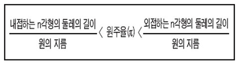
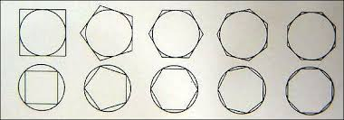

## Polychimedes

### 원주율에 대하여

- 원주율은 이런 것이다. 

- 이번 프로젝트에서는 원에 외접하는 다각형으로 *사각형* 을 사용한다. 
- 사각형의 네 개의 변에서 착안하여 
    - 한 변을 담당하는 스레드 하나씩을 spawn 한 후
    - join해서 원주율을 계산해내는 로직을 
    - 다양한 프로그래밍 언어로 구현해 본다. 

### Strategy 

- 하나의 스레드가, 하나의 사분면을 담당한다. 
- 일정한 크기의 사분면에서 설정된 수 만큼의 점을 찍는다. 
- 부채꼴의 범위 안에 착탄(?) 한 점의 개수를 센다. 
    - 센 후, 착탄한 점의 개수 / 뿌린 점의 개수를 계산 
        - 예를 들어, 100개 발사/78개 착탄 = 0.78
- 스레드 네 개가 작업을 마칠 때까지 기다린 후, 합산하여 원주율 산출

### 시도해볼 언어 

- Golang
- Java
- Kotlin
